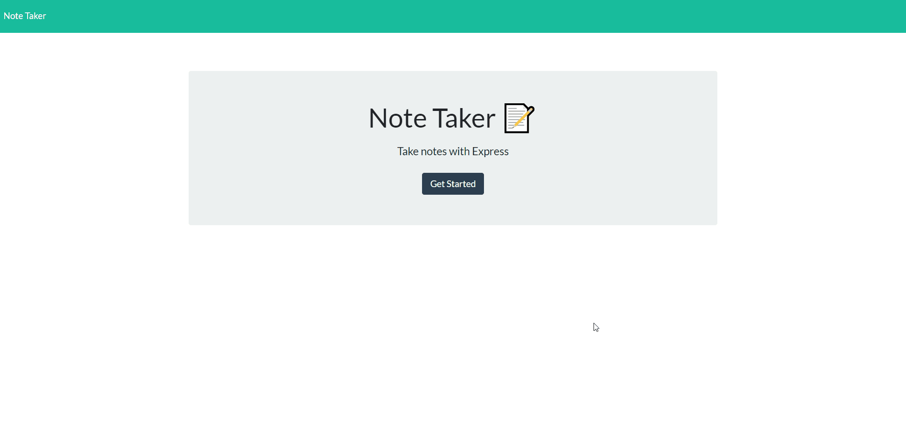

# Note-Taker

  

  ## Description

  An application to write and save notes in order to keep track of tasks and important information.
  
  
  ## Table of Contents
  
  - [Installation](#installation)
  - [Usage](#usage)
  - [Contributing](#contributing)
  - [Tests](#tests)
  - [Questions](#questions)
  
  ## Installation
  - No installation for using the application.
  - To run the application on the command line:
  - Run the command "npm i" to install node dependencies
  - Run the command "npm start" to start the server
  - Copy the address from the terminal console log and paste into web browser
  
  
  
  ## Usage

  [Link to the application](https://evening-anchorage-54673.herokuapp.com/)
  
  [Link to the Note-Taker repository](https://github.com/cdfoye/Note-Taker)

  Please refer to the following gif tutorial on how to use the application.

  
  
  ## Contributing

  For contribution, reach out to me on Github or send me an email.
  
  ## Questions

  If you have any questions please visit my Github profile: [cdfoye](https://github.com/cdfoye)

  For additional questions you can email me at cdfoye@gmail.com
  

